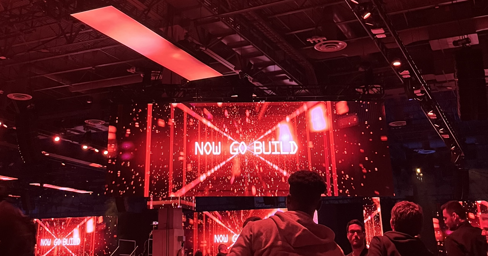

My goal of the year is to build a new project every month. This is something I’ve been wanting to do for many years after watching [Pieter Levels’ talk](https://youtu.be/6reLWfFNer0?si=JxrypooVr0dSOl-W), but I didn’t dare to try it while working full-time. Now that AI has made it much easier to write code, I decided there’s no better time than now to start. I'm going to publish the projects here no matter how good or bad they turn out, so stay tuned!

*Amazon CTO, Werner Vogels' closing remark in AWS re:Invent 2023*
