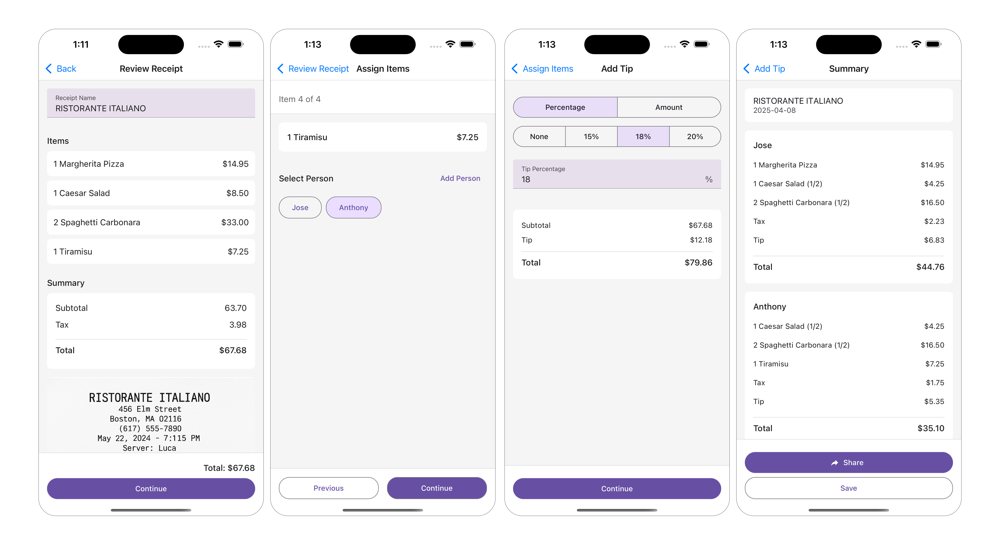
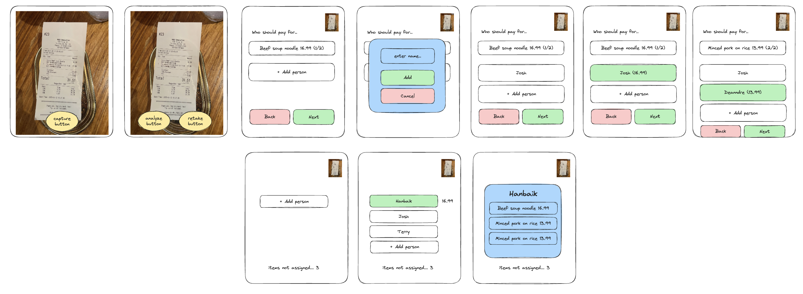
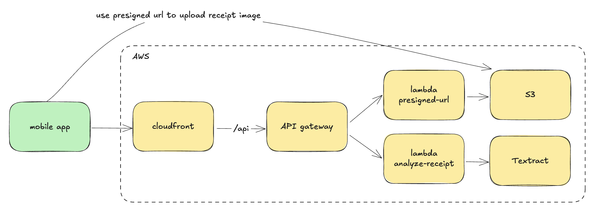

Let me introduce you to Billy!

Billy is an app that helps you split bills with your friends. Once you upload a photo of your receipt, Billy scans it and gives you a simple UI to assign items to each person. At the end, it provides a clear breakdown for each person that you can easily share with your friends. 

The app is only available on the App Store for now, but I plan to release it for Android soon. Give it a try and let me know if you run into any bugs or have feedback.

[App Store Link](https://apps.apple.com/ca/app/billy-split-bills-instantly/id6736915357)

#### How did this come about?
Sometimes restaurants (especially Asian ones) won’t split the bill for us when I eat out with friends here in Toronto. So one person ends up getting the bill and has to split it afterwards, which is always a hassle to figure out who ordered what and to calculate taxes and tips proportionately. I used to use Google Sheets to do the math, and even though it didn’t happen often, it was annoying enough that I decided to build an app for it. Below is an early wireframe I made when I was in Korea this past winter.

#### Tech stack
I went with React Native for the frontend since I’m most familiar with React and chose serverless for the backend to keep things as cheap as possible. The bulk of the frontend code was actually written by Cursor/Claude one morning when I woke up too early and had some time before work. It was especially useful for setting up Expo, navigation, screens, etc, which would have taken me a lot longer to figure out. Below is a simple diagram of the technical architecture I used to build the app. 

1. The client requests a presigned URL from the backend.
2. The client uses the presigned URL to upload the receipt image directly to S3.
3. The client sends a request to the backend to analyze the receipt.
4. The client uses the analyzed receipt response to assign people and calculate the price per person.