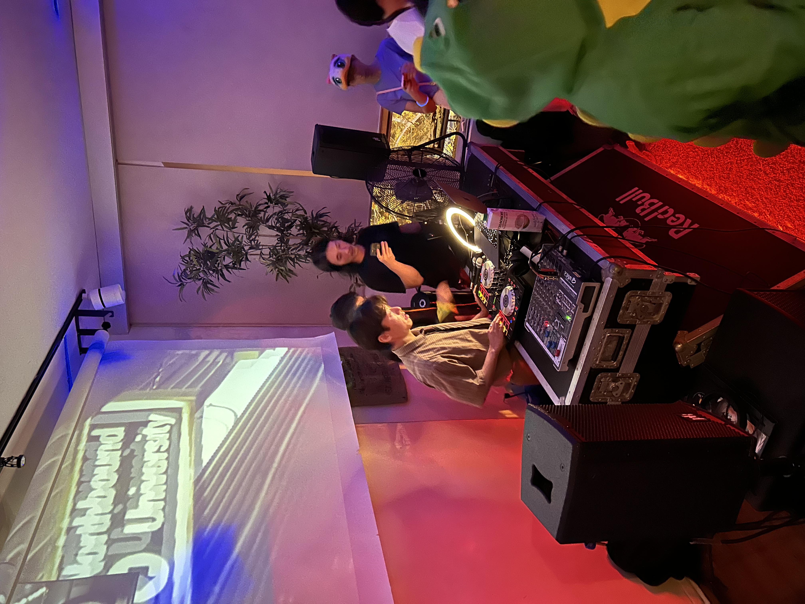
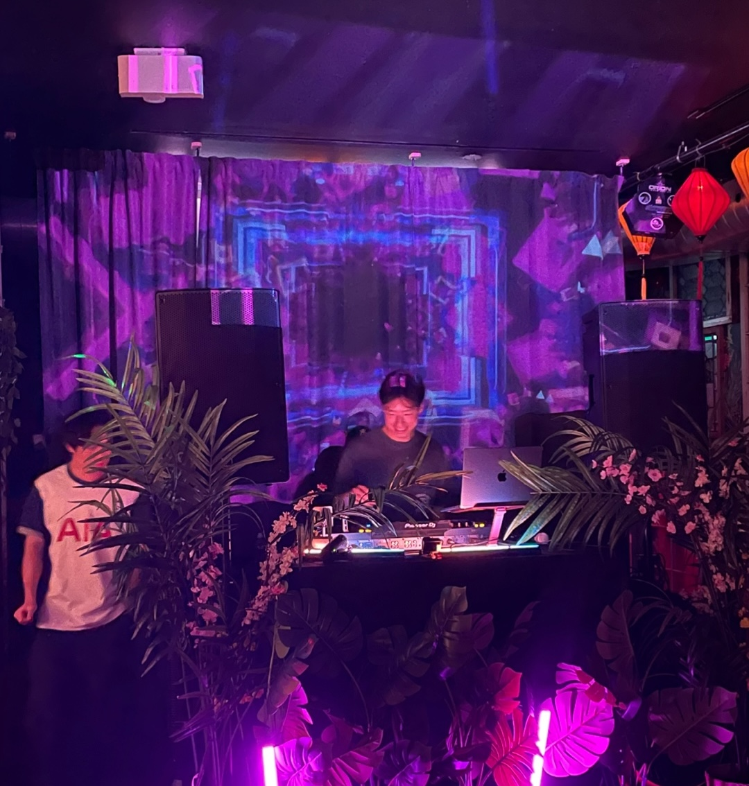
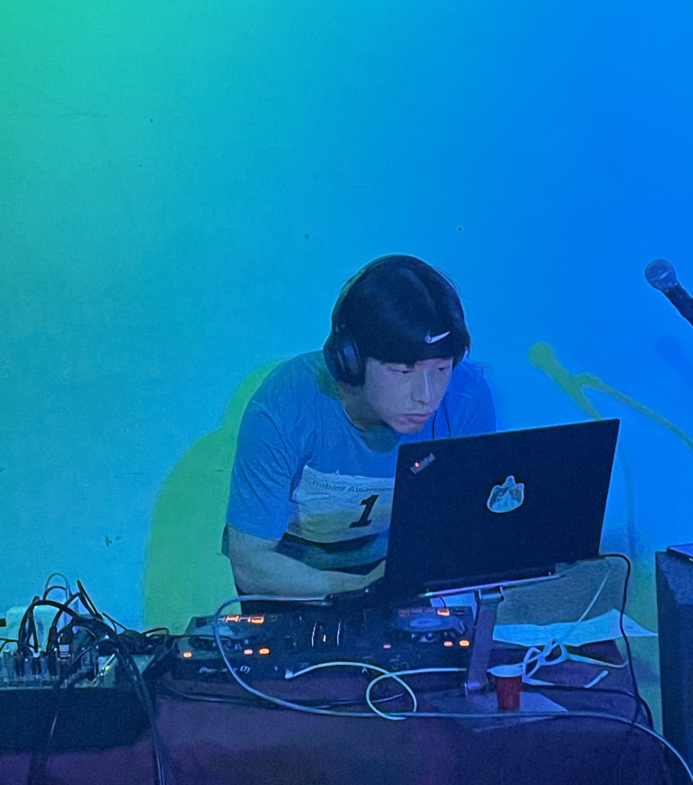



Ever since my college roommates took me to my [first EDM show](https://en.wikipedia.org/wiki/True_Colors_Tour) in sophomore year, I've been a fan of electronic music and have gone to many shows and festivals where I danced my ass off and made great memories with friends. I grew to admire DJs who play just the right song at the right time to keep the energy pumping and take the crowd on a journey.

I always had an interest in DJing, but it never materialized until last year when my friend Joseph asked me if I wanted to play a set at his Halloween party. I had no idea how to DJ, but I said yes anyway. I spent the next two weeks scrambling to learn how to DJ and ended up performing at a party with over 80 people. I still can't forget the adrenaline rush when the crowd went hard to a [song](https://www.youtube.com/watch?v=nuGuqYNC4HU) that I wasn't sure if they'd like.

This summer, I DJed at Joseph's KPOP party with over 130 people and another Halloween party last month. I'm grateful for my friend for giving me a chance to pursue something I had only ever dreamed of doing. It’s stressful leading up to a party because I have to prepare my set, but it all pays off when I see the crowd enjoying the music I put together.

This past weekend, I recorded my Halloween set at home to have something to look back on. It's embarassing, but you gotta start somewhere, right? Hopefully it'll age well like [mkbhd](https://www.youtube.com/watch?v=9gk_rl3y_SU) or [MrBeast](https://www.youtube.com/watch?v=AKJfakEsgy0)'s early videos. I plan to upload more as I continue DJing. Give it a listen and let me know what you think!

