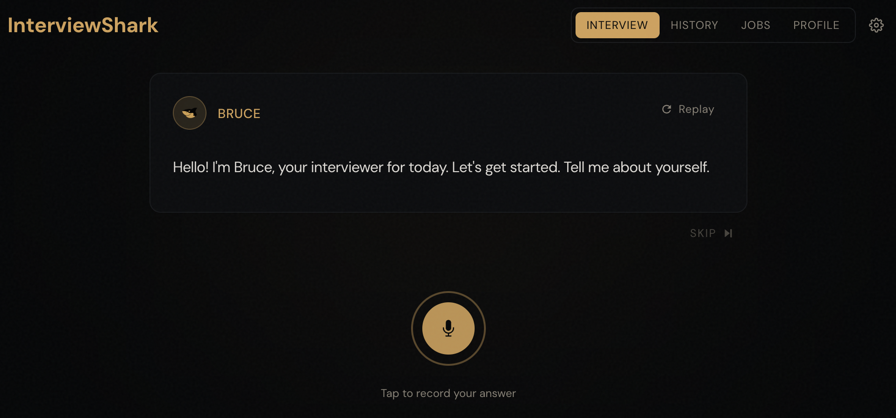

Last month, I said I would build a project every month in 2026. The first project from that initiative is [**InterviewShark**](https://interviewshark.sungatae.com/). It is an AI mock interview tool that helps you practice answering interview questions and receive feedback so you can improve your answers. I built it because I often came out of interviews with regret after rambling too much, missing the point of the question, not going into enough details about my experience, and worst of all, getting lost in my own story.

InterviewShark is designed to help you improve your answers by providing constructive feedback and being that friend who is always down to do mock interviews. InterviewShark evaluates your answer based on relevance, quality, and structure, and drafts an improved version to give you better guidance. You also have the option to upload the job description for the role you are interviewing for to create a more realistic mock interview experience. With enough practice, giving polished answers will start to feel like second nature by the time the real interview comes around.

InterviewShark is a safe space where you can get the benefits of mock interviews without the embarrassment of practicing with real people. I've been using it while building it and it has already made a big difference in my confidence during interviews. So give it a try if you want to level up your interview game.

https://interviewshark.sungatae.com/

## How I built it
### React / Python / OpenAI
I used React+Vite for the frontend and Python for the backend. I used WebSockets for supporting bidirectional communication between the user and the AI interviewer. One thing I wish I had done is to stream the user audio to the server like it is done in the [voice sandwich demo](https://github.com/langchain-ai/voice-sandwich-demo), but I opted for a simpler approach of recording the audio in the browser and sending the audio file to the backend. This could mean slower response time depending on the audio file size and internet speed and also misses out on features like live transcription. I used OpenAI models for everything from audio (speech-to-text, text-to-speech) to LLM (question generation, answer evaluation, memory update). I used the OpenAI SDK which temporarily locks me in but I like the simplicity of having one API key and one dashboard to monitor all my API calls.
### Supabase
I used Supabase for auth and DB. Supabase was surprisingly easy to set up and use. I used Stripe for payments, which felt daunting at first because setting up RevenueCat for [Billy](https://sungatae.com/posts/billy/) was not easy, but I got everything working fairly quickly once I figured out what I needed (products/webhooks/API endpoints). I also like that Stripe handles the purchase page so there was very little frontend work for me to do. 
### Vercel
The frontend is deployed to Vercel, which has a generous free tier of up to 1 million edge requests. I initially considered Cloudfare pages, but it requires your domain to be on Cloudfare, which was a deal breaker for me because sungatae.com is on AWS Route 53. I use the subdomain [interviewshark.sungatae.com](https://interviewshark.sungatae.com/) because I didn't want to pay for a new domain.
### Hetzner
I used Hetzner to host my Python server. It was the cheapest server I could find that does not go idle when not in use. The trade off was speed and complexity. The server is in Helsinki and since Hetzner gives you a bare VM, I had to set everything up from scratch, from installing packages to configuring Nginx and the Python server. There is no continous deployment at the moment so if I want to deploy a new version of the backend, I have to SSH into the instance, pull the latest code from GitHub, and restart the server manually. It is weirdly satisfying to work this way because most of this work is now abstracted away by cloud and PaaS providers.
### Claude Code / Codex
It goes without saying that this project wouldn't have been possible without coding agents. I usually start with Claude Code and switch to Codex when I hit the usage limit. I remember Codex being painfully slow the first time I used it, but it has gotten much faster since then. I used Claude Code's [frontend design skill](https://github.com/anthropics/claude-code/blob/cd4956871a56b07d9d2a6cb538fae109d04c9d57/plugins/frontend-design/skills/frontend-design/SKILL.md) for frontend tasks and I am very impressed with how it turned out. I specifically asked it to use shadcn because I kept seeing it mentioned online and wanted to try it for myself. For larger changes, I used the planning feature and asked the agents to write the plan in a markdown file so I can look back to it later. More recently, I started using the Playwright skill for debugging and having the coding agent verify the fix before declaring it done. Claude Code also wrote a security report and found high risk vulnerabilities that would have been problematic if I had released the project without fixing them.
### Ideogram
I tried ChatGPT and Nano Banana for creating the logo, but neither gave me a logo that I was happy with. ChatGPT generated a logo that was too small although I asked it to fill the specified dimensions. I asked for a cute shark, but it generated a fierce looking shark with sharp teeths. I don't remember exactly what Nano Banana generated, but it was not much better. What gave me the best result was Ideogram, a Toronto based startup. I first heard about the company because one of their recruiters reached out to me about a software engineer role. i was a bit skeptical at first, but it ended up generating exactly what I was looking for: a cute, non-threatening shark that was simple and clean.

