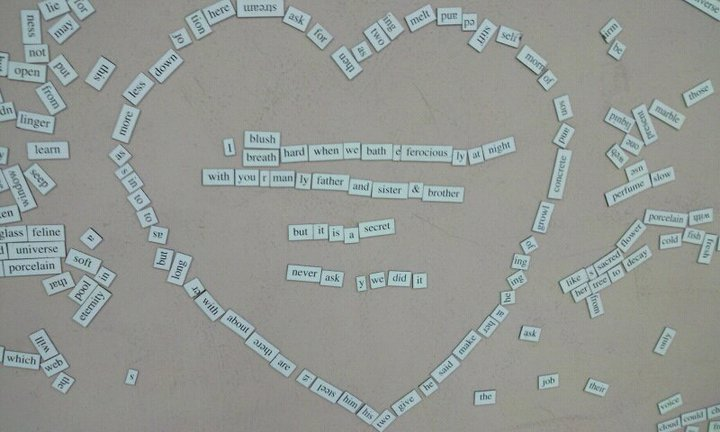
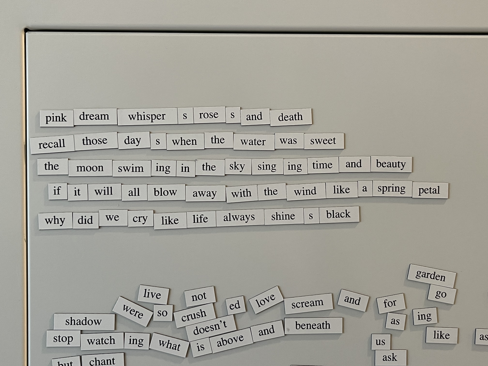

In my literature classroom in high school, there used to be a wall with magnetic word pieces that you could use to make poems. It was called [Magnetic Poetry](https://magneticpoetry.com/collections/essentials/products/original-kit) and I remember we had so much fun writing weird poems. I randomly came across this photo recently and thought it would be fun to have one at home too.

So I purchased one last week and put it up on the metallic cover of my fan coil unit. This is a poem I wrote this morning. It's a fun little activity to do while having my morning coffee. I realized that I have far fewer words than the set we had in high school. I'll need the expansion packs to come up with poems as scandalous as the one we wrote back then.

