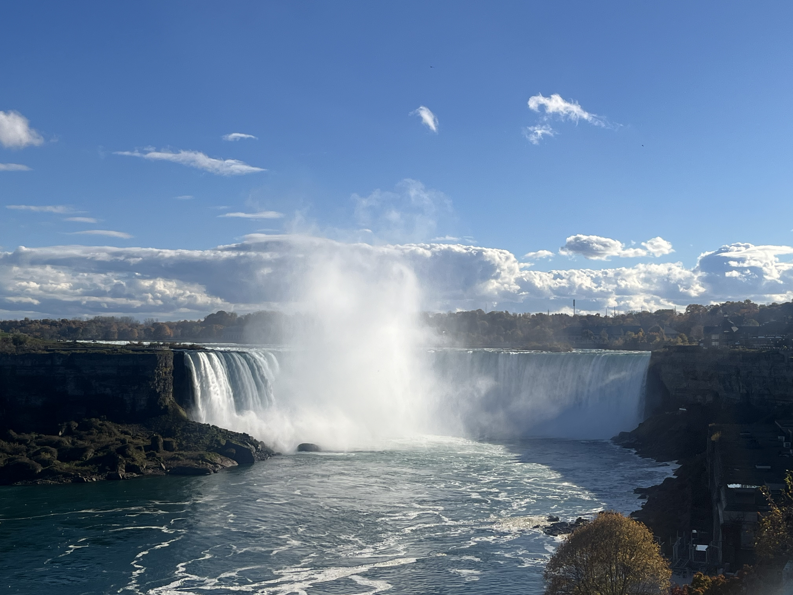
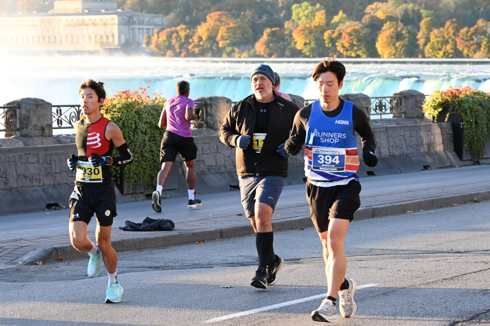
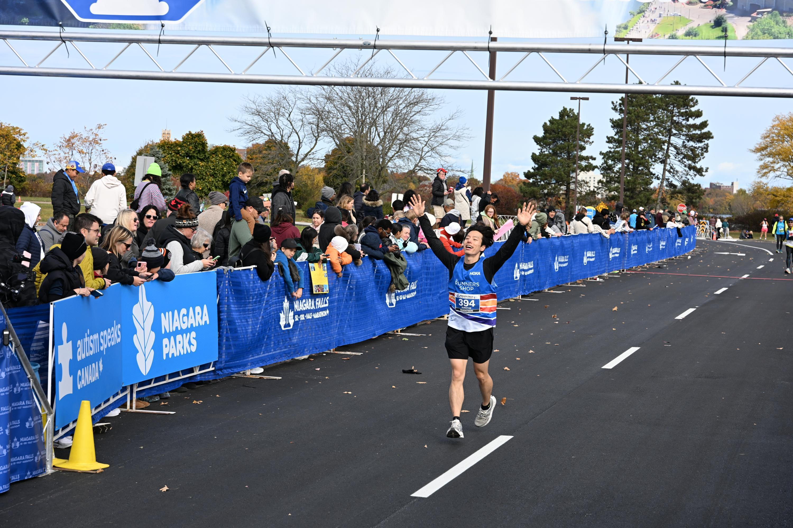

I ran my first marathon at Niagara Falls two Sundays ago.

When I started running at the beginning of last year, I never thought I would run a marathon. I ran simply because I wanted to get better at soccer. In fact, I never liked running growing up because it was boring and tiring. But this time was different. I was still tired, but I felt good after my runs. It helped me clear my mind. It was therapeutic.

Running slowly grew on me and I decided to sign up for a [10k race](https://raceroster.com/events/2023/62866/2023-sporting-life-10k) with my coworker Hemish. The energy at the race was electric. It was a beautiful Sunday morning - sunny, clear sky, crisp air, and big smiles on people's faces. Running through one of the busiest streets in Toronto's downtown and along the highway overlooking the lake was an exciting way to experience the city.

I started to run regularly and decided to join a running club at [The Runners Shop (TRS)](https://www.therunnersshop.com/collections/run-club) where I bought my first pair of running shoes. I still vividly remember my first day because I just couldn't keep up with the group. I ran out of gas after two laps around the [park](https://maps.app.goo.gl/jXfs2rY4HNaLXJLo9). I probably would've quit if it wasn't for Dennis who came up to me that day and told me that I would be able to catch up very soon if I kept showing up to the runs. So that's what I did - I showed up. And, as I was told, I improved gradually.

Joining a running club brought changes to my life in ways that I didn't expect. Most notably, I did not drink as much alcohol as I used to. Since we ran on weekend mornings, I had to go to bed early the night before. As a result, I stayed in on Friday and Saturday nights, times I would normally spend going out with friends to relieve stress accumulated during the week. But I didn't need pints of beer or tequila shots anymore because running had the same stress-relieving effects, if not better, without making me feel terrible the next morning. It was refreshing to start the weekend: 1) early and 2) without a hangover.

The people I met there were inspirational. I am usually in a group with Lynn, Dennis, and Steve who have all been runners for at least 20 years. Steve joined TRS at the turn of the century in 2000. It's hard to believe how fit and healthy they are, considering they are my parents' age. Their welcoming smiles and laughs during the run show that running has not only cultivated a healthy body for them but also a healthy mind. It's only been only a year since I started running, but they inspire me to keep running for as long as I can. I decided early on that my goal as a runner is not to beat time but to keep running despite the passing of time.

My time for the marathon was 3:48:28. It is a result that I am extremely proud of, especially because there were moments during the race when I felt like giving up and walking the rest of the way. The race was bumpy even before the start. I arrived 45 minutes late to the starting line because of shuttle bus delays and traffic from road closures. Some people couldn't even run the race because they got there too late.

As soon as I got off the shuttle, I checked in my belongings and started the race right away. It was 2 degrees that morning so my legs were cold and stiff. To make things worse, my stomach started to hurt as soon as I took a sip of water from the aid station. It caught me off guard because it had never happened to me so early in the race before. Luckily, my legs loosened up and stomach felt better about an hour into the race. I was even hopeful at the halfway mark, believing that I could maintain my pace until the finish line.

But things took a sharp turn with 8km left to go. My right knee started to lock up and I couldn't fully bend it anymore. It forced me to put more weight on my left leg, which caused my left toes to cramp up. I also felt my hamstring and lower calves constantly threatening to give up if I took one more step. My pace slowed down noticeably against my will, undoing all the hard work I had put in up to that point. I was in pain and discouraged. I had to constantly remind myself to "bring it home", that stopping here was simply not an option. Those 8km never felt so long, but I managed to power through and crossed the finish line. At that moment, a sense of relief swept over me and all I could think of was going back home and lying in my bed.

