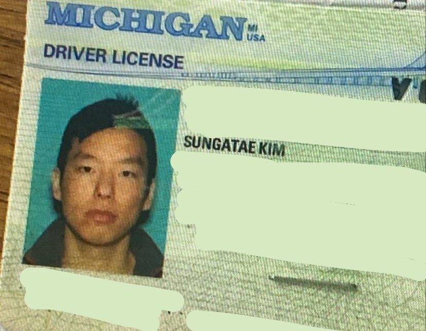

After a visit to the DMV in 2016 to get my driver's license, I received a license in the mail with my name misspelled. Instead of **Sungtae Kim**, it had **Sungatae Kim** with an awkward "a" between the two syllables of my first name (scroll down to see the license). At the time, I couldn't be bothered to visit the DMV again, so I carried it around for almost 2 years until I got it fixed.

When starting out this blog, I originally wanted **sungtae.com**, but unfortunately the domain had already been taken. I could've compromised with a different TLD (I once owned **sungtae.life**), but I wanted the dotcom this time around. It adds an air of legitimacy that other TLDs like .life, .io, .co do not carry.

I had already used **@sungatae** as my Instagram handle before so I decided to use it for my blog too. Luckily, "sungatae" is not as commonly used as "sungtae" so I was able to buy the dotcom domain without difficulty.

The word "sungatae" is funny when you say it out loud, but I do like the look of it. It is sleek and slender, if you know what I mean. Anyway, that is the short story of how [sungatae.com](sungatae.com) came about.

